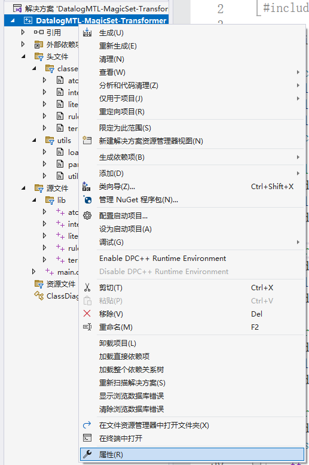
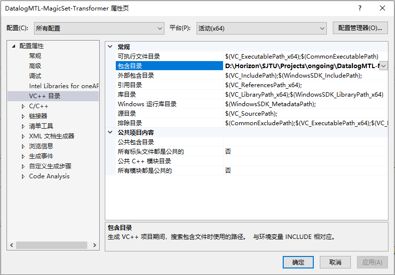
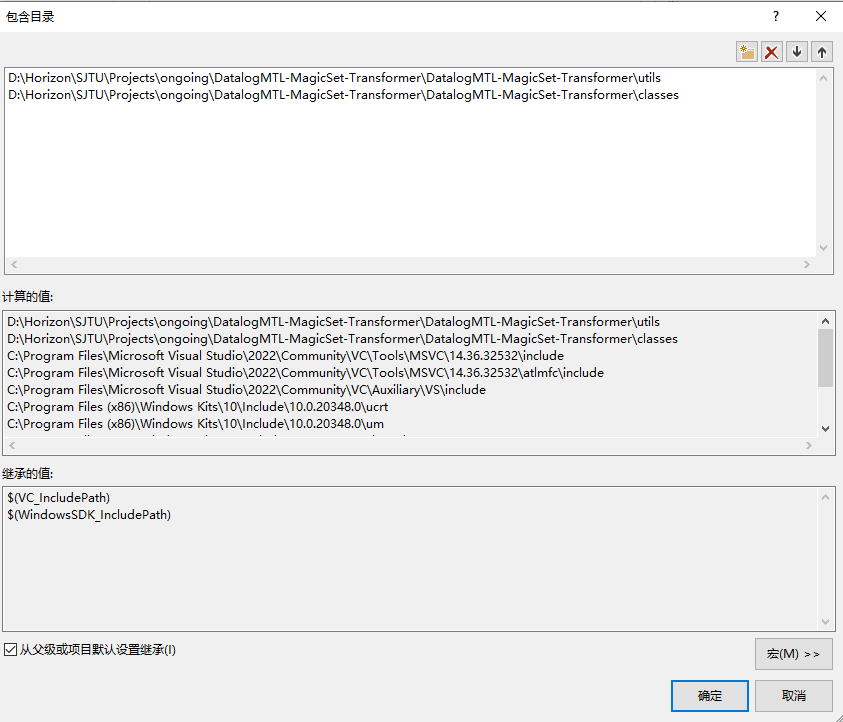

# DatalogMTL-MagicSet-Transformer

## Configurations

## Method 1

1. mkdir build

2. cd build

3. cmake ..

4. cmake --build . --clean-first

## Method 2

1. Open .sln or add files manually in Visual Studio 2022 as below (or use your own cmakefiles):

2. Add include path to the solution as below:

## Tips

1. Use a class diagram (provided by visual studio) to see the relationships of the classes in it.